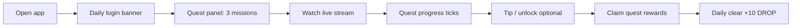

# 09 — Fan Quests + Set Score (Vertical Slice)

> **Status:** Design spec · **Not implemented**  
> **Goal:** Make LiveBooth feel like a game in one shippable slice — without new infra, tokenomics changes, or pay-to-win.

**Related docs:** [03-achievements](./03-achievements.md) · [04-features-differentiation](./04-features-differentiation.md) · [06-user-flows](./06-user-flows.md) · [07-development-phases](./07-development-phases.md)

---

## 1. Summary

This slice adds two connected systems:

| System | Who it serves | One-line pitch |
|--------|-----------------|----------------|
| **Fan quests** | Listeners | “Three small missions today — watch, tip, unlock — claim DROP when done.” |
| **Set score** | Fans + DJs | “This set earned an **A** — 4,280 pts. You helped hit the unlock goal.” |

Together they create a **daily habit loop** (quests) and a **per-set climax** (score + grade on recap). They extend what already exists — daily login bonus, achievements, session goals, session recap — rather than replacing them.

### Design principles for this slice

1. **Quests are free to complete** — no paywall; spending DROP is optional quest types, never required for all three slots.
2. **Set score is collaborative** — fans see the DJ’s booth score rise; DJs see which fan actions moved the needle.
3. **Achievements stay long-term; quests stay short-term** — achievements = trophies; quests = today’s to-do list.
4. **Reuse event data** — tips, unlocks, watch minutes, follows, chat messages already exist or are easy to derive.
5. **Juice over complexity** — animated progress, grade reveal, and quest-complete moments matter more than deep RPG stats in v1.

---

## 2. What exists today (baseline)

| Feature | Location | Gap this slice fills |
|---------|----------|----------------------|
| Daily login bonus | Home banner, 5 DROP/day | One action; no structured “what to do next” |
| Fan achievements | `/achievements`, 8 fan badges | Long horizons (20 unlocks, 6 months); no daily loop |
| Session goals | DJ dashboard only | Fans don’t see goals; not framed as a “score” |
| Session recap | DJ modal after end stream | Stats only; no grade, no fan contribution |
| Leaderboard | `/leaderboard` | All-time/weekly ranks; no per-set moment |
| Watch minutes | `User.watchMinutes` | Not surfaced as quest progress |

---

## 3. Fan quests

### 3.1 Scope (v1)

- **3 quest slots per fan per calendar day (UTC)** — reset at midnight UTC.
- **Pool of ~12 quest templates** — server picks 3 per user (one easy, one medium, one stretch).
- **Rewards:** 3–15 DROP per quest + **bonus 10 DROP** if all 3 completed same day (“Daily clear”).
- **No rerolls in v1** — keeps scope small; reroll one slot is v1.1.

### 3.2 Quest template catalog

| ID | Label (UI) | Trigger | Target (example) | Difficulty | Reward |
|----|------------|---------|------------------|------------|--------|
| `watch-10` | Warm up | Watch live ≥ N minutes (presence heartbeat) | 10 min | Easy | 3 DROP |
| `watch-30` | Deep listen | Watch live ≥ N minutes | 30 min | Medium | 8 DROP |
| `first-tip-day` | Tip the drop | Send ≥ 1 tip today | 1 tip | Easy | 5 DROP |
| `tip-25` | Show love | Send ≥ N DROP in tips today | 25 DROP | Medium | 10 DROP |
| `unlock-1` | Track ID | Unlock ≥ 1 track ID today | 1 unlock | Medium | 7 DROP |
| `follow-1` | New voice | Follow a DJ you don’t follow yet | 1 follow | Easy | 4 DROP |
| `chat-3` | In the booth | Send ≥ N chat messages on live streams | 3 msgs | Easy | 3 DROP |
| `discover-genre` | Genre night | Watch ≥ 10 min in spotlight genre (when active) | 10 min | Medium | 8 DROP |
| `claim-daily` | Show up | Claim daily login bonus | 1 claim | Easy | 3 DROP* |
| `request-1` | Crowd call | Submit ≥ 1 paid track request | 1 request | Stretch | 12 DROP |
| `two-djs` | Crate digger | Watch ≥ 5 min on 2 different live DJs | 2 DJs | Stretch | 10 DROP |
| `stake-check` | Back a DJ | Stake ≥ min DROP on any DJ/station (if staking enabled) | 50 DROP | Stretch | 15 DROP |

\*`claim-daily` reward stacks with existing daily bonus — quest reward is separate “quest payout” ledger entry.

**Selection rules:**

- Always include at least one **non-spend** quest (`watch`, `chat`, `follow`, `claim-daily`).
- Never all three spend-based.
- If user has 0 balance, exclude `request-1` and `tip-25`.
- On **genre night**, 50% chance to replace `watch-10` with `discover-genre`.

### 3.3 Progress & completion

- Progress stored per `(userId, questInstanceId, date)`.
- **Watch time:** accumulate from existing presence/watch pipeline (same source as `watchMinutes` / stream heartbeat).
- **Tip/unlock/follow/chat:** increment on successful ledger or API events (idempotent).
- **Completion:** auto-detect; user taps **Claim** on finished quest (or auto-claim optional in v1.1).
- **Daily clear:** when 3/3 claimed, show confetti + credit 10 DROP bonus.

### 3.4 Fan UI surfaces

| Surface | Behavior |
|---------|----------|
| **Quest panel (home)** | Below daily login banner; 3 cards with progress bars; “Claim” buttons |
| **Quest chip (stream page)** | Collapsed: “2/3 quests today”; expanded: relevant quests only (e.g. watch + tip on this stream) |
| **Nav badge** | Dot on Rewards or new “Quests” icon when unclaimed completions exist |
| **`/achievements`** | New section at top: “Today’s quests” linking to same panel |

**Empty states:**

- Not logged in → “Sign in to earn daily quests”
- All complete → “Daily clear! +10 DROP — come back tomorrow”

### 3.5 Relationship to achievements

| | Quests | Achievements |
|--|--------|--------------|
| Horizon | Today | Weeks / months |
| Reward | Small DROP (3–15) | Larger DROP + badge |
| UI | To-do list | Trophy case |
| Overlap | Quest progress can **also** advance achievement metrics | No change to achievement rules |

Example: completing `unlock-1` quest also counts toward `track-hunter` achievement progress.

---

## 4. Set score

### 4.1 What it is

A single **Set Score** (integer points) computed for each ended stream, plus a **letter grade** (S / A / B / C / D) vs the DJ’s own history — not vs other DJs globally (avoids discouraging small booths).

Shown:

- **Live (fans):** score ticker + “community goal” bar on stream sidebar (optional v1: score updates every 30s).
- **Live (DJ):** same as session goals area — merge into one “Booth score” module.
- **End of set:** grade reveal on recap (DJ modal + shareable card for fans who were present).

### 4.2 Score formula (v1)

Points accrue during the live stream and finalize at `endedAt`.

| Component | Points | Cap | Notes |
|-----------|--------|-----|-------|
| Tips received | 1 pt per 1 DROP tipped | 2,000 | Primary driver |
| Track unlocks | 25 pts each | 500 | Rewards track ID engagement |
| Unique tippers | 50 pts each | 500 | Max 10 unique |
| Peak viewers | 2 pts per viewer | 400 | Uses `peakViewers` |
| Chat messages | 1 pt per 5 messages | 200 | Stream-scoped chat count |
| Requests accepted | 30 pts each | 300 | DJ accepted crowd requests |
| Duration bonus | 10 pts per 15 min live | 200 | Min 15 min to earn |
| **Quest contributions** | 20 pts per fan quest completed *during this stream* | 200 | Links quests → set |

**Total theoretical max (v1):** ~4,100 pts (most sets land 800–2,500).

```
setScore = sum(components), clamped 0–9999
```

### 4.3 Grading

Grades are **per DJ, rolling personal baseline**:

- Store last **20 ended streams’** scores for each DJ.
- **Median** of those = `personalPar`.
- Grade thresholds vs `personalPar`:

| Grade | Condition | UI tone |
|-------|-----------|---------|
| **S** | ≥ 1.4 × par AND score ≥ 1,500 | Gold pulse, “Personal best tier” |
| **A** | ≥ 1.15 × par | Green |
| **B** | ≥ 0.85 × par | Default |
| **C** | ≥ 0.6 × par | Neutral |
| **D** | below 0.6 × par | Encouraging copy, no shame |

**First 3 streams ever:** fixed thresholds (500 / 1,000 / 1,500 / 2,000) until baseline exists.

**New DJ copy:** “Building your baseline — keep streaming!”

### 4.4 Fan contribution (social layer)

For fans who were present (watch heartbeat ≥ 5 min on that stream):

- Show on recap card: **“You contributed +X to this set”**
  - +20 if they completed a quest during the stream
  - +1 per DROP tipped (cap display at 100)
  - +25 if they unlocked a track

Fans can **share** a small card: “I helped Neon Pulse hit an **A** (2,140 pts) on LiveBooth.”

### 4.5 DJ UI integration

Replace or wrap existing **Session goals** with **Booth score**:

```
┌─ Booth score ──────────────────── 1,840 pts ─┐
│ ████████████████░░░░  → Grade pace: A        │
│ Tips 920 · Unlocks 12 · Peak 84 · Quests 3   │
└──────────────────────────────────────────────┘
```

On stream end, extend **Session recap modal**:

```
SET COMPLETE — GRADE A
2,140 pts  (+18% vs your usual)

Top tippers · 3 fans cleared quests mid-set
[Replay] [Share grade]
```

### 4.6 Fan UI on stream page

Compact sidebar block (below viewer tips):

```
Set score  1,840 ↑
████████░░  72% to A-tier pace
Tip or unlock to push the score
```

Optional: when score crosses a grade threshold mid-set, chat system message:  
`🎯 Booth hit A-tier pace — keep it going!`

---

## 5. User flows

### 5.1 Fan — morning habit



### 5.2 Fan — during a set

1. Join stream → quest chip shows “Watch 10 min (4/10)”.
2. Set score visible in sidebar; ticks up when they tip.
3. Complete quest → “+20 set score” toast; DJ booth score updates on next poll.

### 5.3 DJ — one session

1. Go live → booth score at 0, session goals replaced by score breakdown.
2. Mid-set → sees quest contributions in activity line (“3 fans cleared quests”).
3. End stream → recap with grade; streak + score + top tippers.

### 5.4 Return visit

- Fan who missed the set sees on DJ profile: “Last set: **A** · 2,140 pts” (not full recap — VOD link).

---

## 6. Data model (conceptual)

New tables — names illustrative:

### `FanQuestDay`

| Field | Type | Notes |
|-------|------|-------|
| id | cuid | |
| userId | FK | |
| date | date UTC | Unique with userId |
| allClaimed | bool | Daily clear |
| bonusClaimed | bool | |

### `FanQuestSlot`

| Field | Type | Notes |
|-------|------|-------|
| id | cuid | |
| questDayId | FK | |
| slotIndex | 0–2 | |
| templateId | string | e.g. `watch-10` |
| target | int | |
| progress | int | |
| status | enum | active / complete / claimed |
| completedAt | datetime? | |
| streamId | FK? | Stream where completed (for set score link) |

### `StreamSetScore`

| Field | Type | Notes |
|-------|------|-------|
| streamId | FK unique | |
| score | int | Final |
| grade | char | S/A/B/C/D |
| personalPar | int | Median at grade time |
| breakdown | JSON | `{ tips, unlocks, ... }` |
| computedAt | datetime | |

### `StreamFanContribution`

| Field | Type | Notes |
|-------|------|-------|
| streamId, userId | composite unique | |
| points | int | Display contribution |
| tipped | int | |
| questsCompleted | int | |

**Ledger entries:** `quest_reward`, `quest_daily_clear`, existing types unchanged.

---

## 7. API sketch (no implementation)

| Method | Path | Purpose |
|--------|------|---------|
| GET | `/api/quests/today` | 3 slots + progress + claim state |
| POST | `/api/quests/claim` | `{ slotId }` → credit DROP |
| POST | `/api/quests/claim-daily-clear` | Bonus when 3/3 claimed |
| GET | `/api/streams/[id]/set-score` | Live score + breakdown (public) |
| GET | `/api/streams/[id]/my-contribution` | Fan’s contribution (auth) |
| POST | `/internal/set-score/recompute` | Called on tip/unlock/chat/end (or inline in existing handlers) |

**Recompute triggers:** tip created, track unlock, request accepted, chat message (batched every 30s), stream ended (final grade).

---

## 8. Economy & abuse

| Risk | Mitigation |
|------|------------|
| Quest farming (idle watch) | Watch requires live stream heartbeat; cap watch quests at 30 min/day credit |
| Multi-account claim | Standard account limits; optional: quest rewards require account age ≥ 24h |
| DJ self-tip score inflate | Self-tips excluded from set score (already excluded from leaderboards?) — verify |
| Score sniping at end | Score updates live; no last-second exploit beyond normal tipping |
| DROP inflation | Quest pool ~40 DROP/day max per fan (3×15 + 10 clear); monitor weekly outflow |

**Budget:** ~40 DROP/day/active fan from quests — comparable to 8 days of daily login at 5 DROP. Acceptable for retention phase; tune rewards down if economy tightens.

---

## 9. Success metrics

| Metric | Target (8 weeks post-launch) |
|--------|------------------------------|
| DAU quest engagement | ≥ 35% of DAU open quest panel |
| Daily clear rate | ≥ 12% of quest starters complete 3/3 |
| Avg sessions per fan week | +15% vs baseline |
| Tips per live stream | +10% vs baseline |
| DJ streams per week | +5% (recap share + grade motivation) |
| Share recap / grade | ≥ 8% of A/S sets get share action |

---

## 10. Implementation phases (within this slice)

### Phase A — Fan quests (≈1 sprint)

- [ ] Schema + seed templates
- [ ] Daily assignment job (on first `/api/quests/today` of the day)
- [ ] Progress hooks on tip, unlock, watch, follow, chat
- [ ] Home quest panel + claim flow
- [ ] Ledger `quest_reward` entries

### Phase B — Set score (≈1 sprint)

- [ ] Score calculator service + breakdown JSON
- [ ] Live poll endpoint; DJ dashboard module
- [ ] Fan sidebar ticker (read-only)
- [ ] Finalize on stream end; store grade

### Phase C — Polish & connect (≈0.5 sprint)

- [ ] Recap modal grade reveal + fan contribution
- [ ] Quest chip on stream page
- [ ] Quest-complete → +20 set score link
- [ ] Share card (copy image or text)
- [ ] Docs + help page update

**Total estimate:** 2.5 sprints for one engineer, assuming existing watch/presence hooks are reliable.

---

## 11. Out of scope (this slice)

- Battle pass / seasons
- Fan XP levels and titles
- Crews / squads
- Mid-set “boss drop” multiplier
- Paid quest rerolls
- Cross-DJ score leaderboards (only personal grade vs self)
- On-chain quest proofs

---

## 12. Open questions

1. **Auto-claim vs manual claim** — Manual feels more “gamey”; auto reduces friction. Recommend **manual claim** for v1.
2. **Quest visibility to DJs** — Should DJs see “12 fans on quests today”? Nice motivator; optional dashboard stat.
3. **Set score on VOD page** — Show final grade on replay? Probably yes, low effort.
4. **Station streams** — Score attributes to resident DJ, not station owner — confirm.
5. **Merge session goals into score** — Deprecate separate goals UI or show both? Recommend **single Booth score** module to avoid duplication.

---

## 13. Copy & tone examples

**Quest complete:**  
> Quest cleared — **Tip the drop** (+5 DROP). Booth score +20.

**Daily clear:**  
> Daily clear! All missions done (+10 DROP bonus).

**Grade reveal (A):**  
> **Grade A** — 2,140 pts. That’s 18% above your usual set. Fans unlocked 14 track IDs.

**Grade reveal (first streams):**  
> **Grade B** — 980 pts. Three more sets and we’ll rank you against your personal best.

---

## 14. Wireframe notes (ASCII)

**Home — quest panel**

```
┌ Today's quests ──────────────────── 1/3 claimed ─┐
│ ○ Watch 10 min        ████████░░  8/10     [—]   │
│ ○ Tip the drop        ██████████  Done    [Claim]│
│ ○ Track ID            ██░░░░░░░░  0/1     [—]   │
│ Complete all 3 for +10 DROP bonus                │
└──────────────────────────────────────────────────┘
```

**Stream — set score**

```
┌ Set score ──────────────────────────────── 1,840 │
│ ████████████████░░░░  On pace for A            │
│ Your quests: Watch 10 min (8/10) on this set   │
└──────────────────────────────────────────────────┘
```

**Recap — grade**

```
╔══════════════════════════════════════╗
║  SET COMPLETE          GRADE  A      ║
║  2,140 pts                           ║
║  Tips 1,020 · Unlocks 14 · Peak 96   ║
║  You contributed +45                 ║
╚══════════════════════════════════════╝
     [ Replay ]  [ Share grade ]
```

---

*Last updated: 2026-06 · Owner: Product · Next step: add Phase A/B to [07-development-phases.md](./07-development-phases.md) when approved.*
